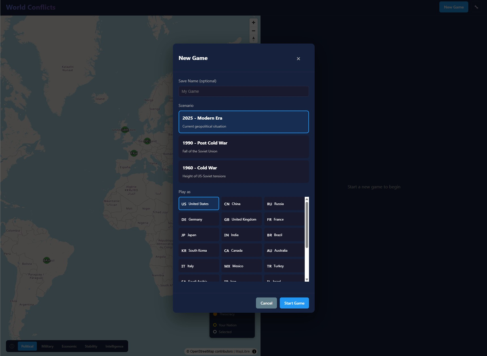
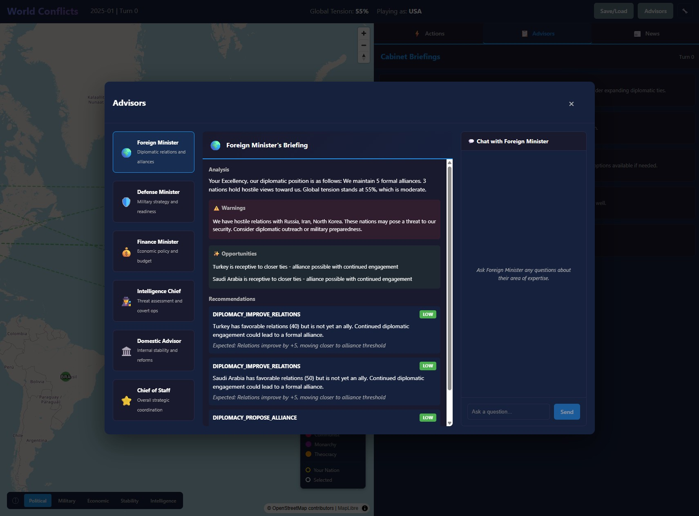
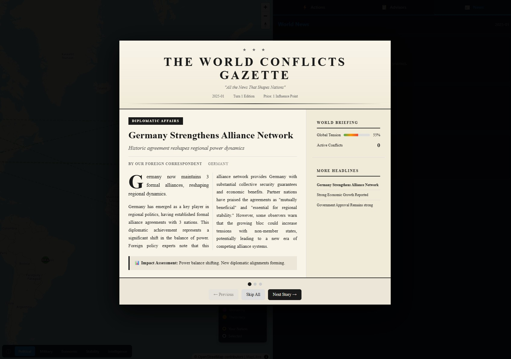
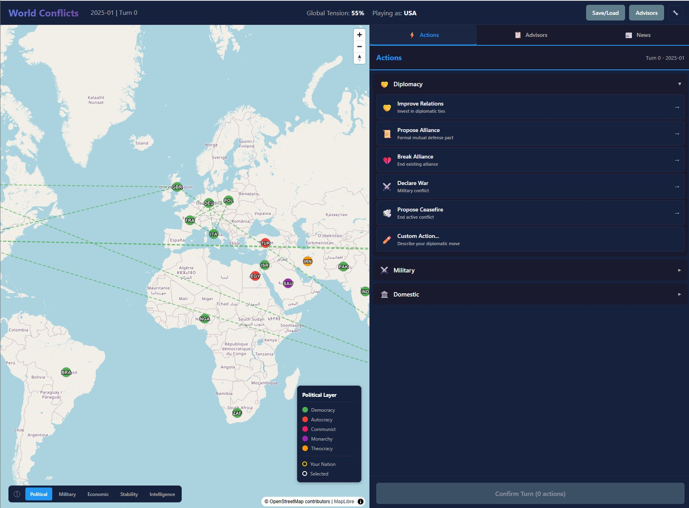
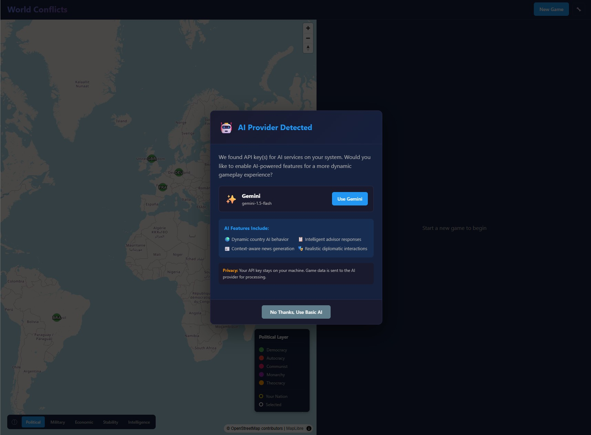

<div align="center">

# 🌍 World Conflict

### *Lead Your Nation. Shape History. Face the Consequences.*

**A geopolitical simulation where every decision echoes through history**

[](LICENSE)
[](https://www.typescriptlang.org/)
[](https://react.dev/)

---

*"This is your captain calling with an urgent warning*  
*We're above the Gulf of Arabia, altitude is falling*  
*And I can't keep her up, there's no time for thinking*  
*All hands on deck, this bird is sinking."*

</div>

---

## 🎮 What is World Conflict?

**World Conflict** is a turn-based global political-military simulation inspired by the 1990 classic *"Conflict: Middle East Political Simulator"*. Step into the shoes of a world leader and navigate the treacherous waters of international diplomacy, military strategy, economic management, and intelligence operations.

Every nation in the game operates as an **autonomous AI agent** with its own goals, beliefs, and decision-making patterns based on real historical behavior. Your choices create ripples across the globe, leading to **plausible alternate histories** that feel authentic and consequential.

### 🎯 Core Experience

- **Lead Any Nation** — From superpowers like the USA, China, and Russia to regional powers and emerging nations
- **Face Real Consequences** — Every action has visible, cascading effects shown *before* you commit
- **Engage with AI Advisors** — Consult your cabinet through natural conversation, each with their own departmental bias
- **Experience Asymmetric Information** — You only see what your intelligence services believe, not ground truth
- **Create Alternate History** — Watch as your decisions reshape global politics in believable ways

---

## 📸 Screenshots

<div align="center">

### Choose Your Destiny


*Step into history as the leader of your chosen nation. Select from major world powers or regional players across different historical periods. Your leadership journey begins here.*

---

### Your Cabinet Awaits


*Receive intelligence briefings from your advisors and engage them in real conversation. Each minister brings their own expertise, biases, and perspective on the challenges facing your nation.*

---

### The World is Watching


*Monitor global media coverage and research how events are being reported. Information is power — but remember, not everything you read is the full truth.*

---

### Shape the Future


*Take decisive action across diplomacy, military operations, domestic policy, and more. Choose from suggested options or give custom directions using natural language. Every choice matters.*

---

### Bring Your Own AI


*Power the simulation with your preferred AI service — OpenAI, local models via Ollama, or fall back to sophisticated algorithmic behavior. Your game, your choice.*

</div>

---

## ✨ Key Features

### 🌐 Living World Simulation
Every country operates as an autonomous agent with persistent goals, historical patterns, and realistic decision-making. Nations form alliances, declare wars, and respond to crises based on their real-world national character.

### 🎭 Asymmetric Intelligence
Your view of the world is filtered through your intelligence services. What you believe may not match reality — and your enemies are operating under their own misconceptions. This creates realistic miscalculations, escalations, and opportunities.

### 💬 Conversational Advisors
Your cabinet ministers aren't just stat screens — they're characters you can talk to. Ask your Defense Minister about military readiness, debate strategy with your Foreign Minister, or press your Intelligence Chief for covert options.

### ⚖️ Consequential Decisions
Before committing to any action, see exactly what effects it will have. Understand the risks, weigh the trade-offs, and own your choices. There's no "undo" in geopolitics.

### 📰 Dynamic News System
Experience your reign through the lens of global media. Monthly newspaper summaries capture the drama of international events, helping you understand how the world perceives your leadership.

### 🏆 Leadership Legacy
At the end of your term, receive a comprehensive historical assessment. How will history remember your leadership? Did you bring peace or chaos? Prosperity or ruin?

---

## 🚀 Getting Started

Ready to lead? See the **[Setup Guide](docs/SETUP.md)** for installation instructions.

**Quick Start:**
```bash
npm install && cd ui && npm install && cd ..
npx prisma db push
npm run dev
```

Then open `http://localhost:5173` in your browser.

---

## 🛠️ For Developers

Interested in contributing or understanding the technical architecture?

- **[Setup Guide](docs/SETUP.md)** — Installation and running the project
- **[API Documentation](docs/API.md)** — REST API reference
- **[Development Guide](docs/DEVELOPMENT.md)** — Architecture, tech stack, and contribution guidelines

---

## 🎲 Design Philosophy

World Conflict is built on these core principles:

1. **Historical Plausibility** — Countries behave according to real patterns, creating believable alternate histories
2. **Information Asymmetry** — Imperfect information creates realistic fog of war
3. **Meaningful Choices** — Every decision has weight and consequence
4. **Accessible Depth** — Easy to start, deep to master
5. **AI-Enhanced, Not AI-Dependent** — Works great with LLMs, still fun without them

---

## 📜 License

MIT License — See [LICENSE](LICENSE) for details.

---

<div align="center">

**Ready to make history?**

*The world is waiting for your leadership.*

</div>
